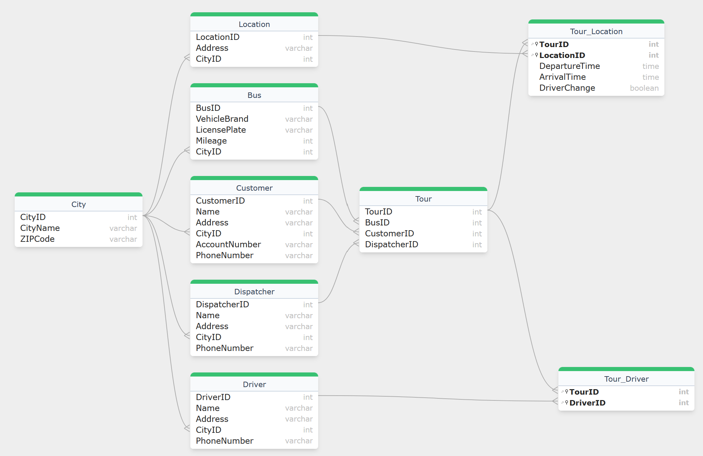

# 01 Tourplaner
## **Anforderungen** (stark zusammengefasst)

    - Busunternehmen mit Disponenten und Fahrern

    - Disponenten planen und organisieren Fahrten

    - Eine Fahrt hat mehrere Stationen

    - Orte dürfen nur einmal angefahren werden

    - Fahrerwechsel an jeder Station möglich

    - Erfassung von Ankunfts- und Abfahrtszeiten pro Station

    - Start-Station: nur Abfahrtszeit; Ziel-Station: nur Ankunftszeit

    - Fahrer und Disponenten über Telefon erreichbar

    - Jeder Fahrt wird ein Fahrzeug mit Sitzplatzanzahl zugeordnet


## Code

```sql
-- City Table
CREATE TABLE City (
    CityID INT AUTO_INCREMENT PRIMARY KEY,
    CityName VARCHAR(255),
    ZIPCode VARCHAR(20)
);

-- Dispatcher Table
CREATE TABLE Dispatcher (
    DispatcherID INT AUTO_INCREMENT PRIMARY KEY,
    Name VARCHAR(255),
    Address VARCHAR(255),
    CityID INT,
    PhoneNumber VARCHAR(20),
    FOREIGN KEY (CityID) REFERENCES City(CityID)
);

-- Driver Table
CREATE TABLE Driver (
    DriverID INT AUTO_INCREMENT PRIMARY KEY,
    Name VARCHAR(255),
    Address VARCHAR(255),
    CityID INT,
    PhoneNumber VARCHAR(20),
    FOREIGN KEY (CityID) REFERENCES City(CityID)
);

-- Bus Table
CREATE TABLE Bus (
    BusID INT AUTO_INCREMENT PRIMARY KEY,
    VehicleBrand VARCHAR(255),
    LicensePlate VARCHAR(20), 
    Mileage INT,
    CityID INT,
    FOREIGN KEY (CityID) REFERENCES City(CityID)
);

-- Location Table
CREATE TABLE Location (
    LocationID INT AUTO_INCREMENT PRIMARY KEY,
    Address VARCHAR(255),
    CityID INT,
    FOREIGN KEY (CityID) REFERENCES City(CityID)
);

-- Customer Table
CREATE TABLE Customer (
    CustomerID INT AUTO_INCREMENT PRIMARY KEY,
    Name VARCHAR(255),
    Address VARCHAR(255),
    CityID INT,
    AccountNumber VARCHAR(255),
    PhoneNumber VARCHAR(20),
    FOREIGN KEY (CityID) REFERENCES City(CityID)
);

-- Tour Table
CREATE TABLE Tour (
    TourID INT AUTO_INCREMENT PRIMARY KEY,
    BusID INT,
    CustomerID INT,
    DispatcherID INT,
    FOREIGN KEY (BusID) REFERENCES Bus(BusID),
    FOREIGN KEY (CustomerID) REFERENCES Customer(CustomerID),
    FOREIGN KEY (DispatcherID) REFERENCES Dispatcher(DispatcherID)
);

-- Tour_Driver Table
CREATE TABLE Tour_Driver (
    TourID INT,
    DriverID INT,
    PRIMARY KEY (TourID, DriverID),
    FOREIGN KEY (TourID) REFERENCES Tour(TourID),
    FOREIGN KEY (DriverID) REFERENCES Driver(DriverID)
);

-- Tour_Location Table
CREATE TABLE Tour_Location (
    TourID INT,
    LocationID INT,
    DepartureTime TIME,
    ArrivalTime TIME,
    DriverChange BOOLEAN,
    PRIMARY KEY (TourID, LocationID),
    FOREIGN KEY (TourID) REFERENCES Tour(TourID),
    FOREIGN KEY (LocationID) REFERENCES Location(LocationID)
);
```

## ERM
