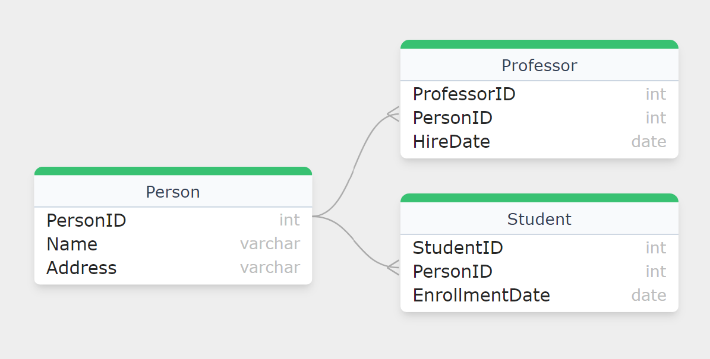
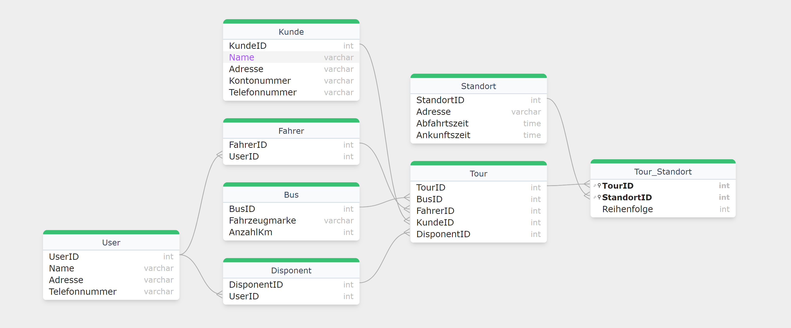

# Generalisierung und Spezialisierung 

Die Datenbankmodellierung basiert auf dem Konzept der Attribute und deren Ausprägungen, die bestimmten Entitätstypen zugeordnet werden. Ein Problem entsteht, wenn mehrere Entitätstypen viele gemeinsame Attribute haben, was zu Redundanz führen kann, falls ein reales Objekt durch mehrere Entitätstypen beschrieben wird, wie beispielsweise Mitarbeiter, die sowohl Kunden als auch Fahrer sind. Um diese Redundanz zu vermeiden, empfiehlt Carl August Zehnder in seinem Werk "Informationssysteme und Datenbanken" aus dem Jahr 1989, dass "lokale Attribute" nur einmal in einer Datenbank vorkommen dürfen. Die Lösung besteht darin, die gemeinsamen Attribute in einem allgemeinen Entitätstypen zu generalisieren, während die spezifischen Attribute bei den einzelnen Entitätstypen verbleiben. Diese Struktur vermeidet Informationsverlust, indem spezialisierte Tabellen über Fremdschlüssel auf die generalisierten Tabellen verweisen, was als "is-a"-Beziehung bekannt ist. Diese Art der Beziehung ist auch in der objektorientierten Modellierung üblich und wird dort durch Vererbung realisiert.

## Beispiel für eine Generalisierung:

## Tourplaner Beispiel

