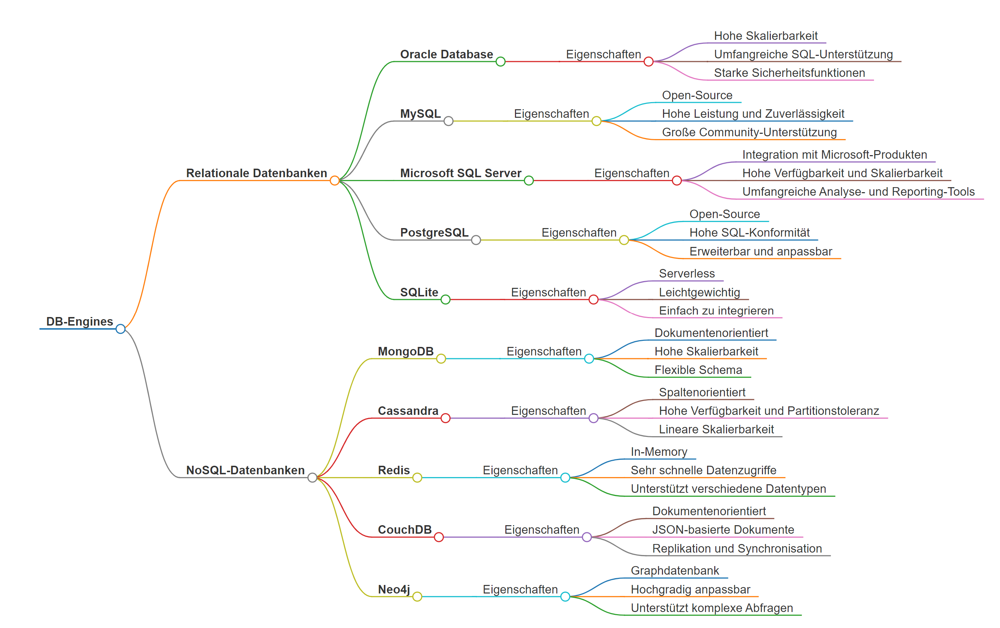

# DBMS (Datenbank Management System)

Ein Datenbanksystem (DBS) ist ein System zur elektronischen Datenverwaltung. Die wesentliche Aufgabe eines DBS ist es, große Datenmengen effizient, widerspruchsfrei und dauerhaft zu speichern und benötigte Teilmengen in unterschiedlichen, bedarfsgerechten Darstellungsformen für Benutzer und Anwendungsprogramme bereitzustellen. Ein DBS besteht aus zwei Teilen: der Verwaltungssoftware, genannt Datenbankmanagementsystem (DBMS) und der Menge der zu verwaltenden Daten, der eigentlichen Datenbank (DB). Die Verwaltungssoftware organisiert intern die strukturierte Speicherung der Daten und kontrolliert alle lesenden und schreibenden Zugriffe auf die Datenbank. Zur Abfrage und Verwaltung der Daten bietet ein Datenbanksystem eine Datenbanksprache an.

## Merkmale eines DBMS

Gemäß seiner Definition muss ein DBMS folgende Funktionalitäten bieten:

- **Integrierte Datenhaltung**: Einheitliche Verwaltung aller benötigten Daten, Speicherung eines logischen Datenelements nur an einer Stelle, schnelle und effiziente Verknüpfung zusammenhängender Daten, kontrollierte Redundanz zur Effizienzsteigerung.
- **Sprache**: Bereitstellung einer Datenbanksprache für Datenanfrage (retrieval), Datenmanipulation (DML), Verwaltung der Datenbank (DDL) und Berechtigungssteuerung (DCL).
- **Benutzeroberflächen**: Anfragesprachen, Programmierschnittstellen, grafische Benutzeroberflächen (GUI), Webzugriff.
- **Katalog**: Zugriff auf Metadaten durch das Data Dictionary.
- **Benutzersichten**: Verschiedene Sichten für unterschiedliche Benutzerklassen, definiert im externen Schema der Datenbank.
- **Konsistenzkontrolle**: Sicherstellung der Datenbankkonsistenz durch Integritätsbedingungen (constraints) und physische Integrität.
- **Datenzugriffskontrolle**: Regeln zur Verhinderung unautorisierter Zugriffe auf die Datenbank (access control).
- **Transaktionen**: Zusammenfassung mehrerer Datenbankänderungen zu Transaktionen, die als Ganzes ausgeführt werden sollen.
- **Mehrbenutzerfähigkeit**: Synchronisation konkurrierender Transaktionen mehrerer Benutzer, um gegenseitige Beeinflussungen zu vermeiden (concurrency control).
- **Datensicherung**: Fähigkeit des DBMS, bei Fehlern einen korrekten Datenbankzustand wiederherzustellen (recovery).

## Vorteile des Datenbankeinsatzes

- **Nutzung von Standards**: Erleichtert Einführung und Umsetzung zentraler Standards in der Datenorganisation.
- **Effizienter Datenzugriff**: Einsatz komplexer Techniken zum effizienten Speichern und Abrufen großer Datenmengen.
- **Kürzere Softwareentwicklungszeiten**: Wichtige Funktionen und Datenbanksprachen entlasten Programmierer von Routineaufgaben.
- **Hohe Flexibilität**: Datenstruktur kann bei sich ändernden Anforderungen modifiziert werden (Datenunabhängigkeit).
- **Hohe Verfügbarkeit**: Synchronisationseigenschaften stellen Datenbank allen Benutzern gleichzeitig zur Verfügung.
- **Große Wirtschaftlichkeit**: Zentralisierung erlaubt Investition in leistungsstärkere Hardware, reduziert Betriebs- und Verwaltungskosten.

## Nachteile von Datenbanksystemen

- **Hohe Anfangsinvestitionen**: Kosten für Hardware und Datenbanksoftware.
- **Allzweck-Software**: Weniger effizient für spezialisierte Anwendungen.
- **Optimierungsprobleme**: Datenbanksystem kann nur für einen Teil der Anwendungsprogramme optimiert werden.
- **Mehrkosten**: Kosten für Datensicherheit, Mehrbenutzer-Synchronisation und Konsistenzkontrolle.
- **Hochqualifiziertes Personal erforderlich**: Benötigt Datenbankdesigner und -administratoren.
- **Verwundbarkeit durch Zentralisierung**: Möglichkeit der Verteilung als Ausweg.

## Einsatz regulärer Dateien

- Kein gleichzeitiger Zugriff durch mehrere Benutzer erforderlich.
- Feste Echtzeitanforderungen, die ein DBMS nicht erfüllen kann.
- Einfache und wohldefinierte Daten und Anwendungen ohne Änderungen.

## Produkte

| DBMS          | Hersteller       | Modell/Charakteristik                       |
|---------------|------------------|---------------------------------------------|
| Adabas        | Software AG      | NF2-Modell (nicht normalisiert)             |
| Cache         | InterSystems     | hierarchisch, “postrelational”              |
| DB2           | IBM              | objektrelational                            |
| Firebird      |                  | relational, basierend auf InterBase         |
| IMS           | IBM              | hierarchisch, Mainframe-DBMS                |
| Informix      | IBM              | objektrelational                            |
| InterBase     | Borland          | relational                                  |
| MS Access     | Microsoft        | relational, Desktop-System                  |
| MS SQL Server | Microsoft        | objektrelational                            |
| MySQL         | MySQL AB         | relational                                  |
| Oracle        | ORACLE           | objektrelational                            |
| PostgreSQL    |                  | objektrelational, hervorgegangen aus Ingres und Postgres |
| Sybase ASE    | Sybase           | relational                                  |
| Versant       | Versant          | objektorientiert                            |
| Visual FoxPro | Microsoft        | relational, Desktop-System                  |
| Teradata      | NCR Teradata     | relationales Hochleistungs-DBMS, speziell für Data Warehouses |

# die wichtigsten 10 DB-Engines
- **DB-Engines**
    - **Relationale Datenbanken**
        - **Oracle Database**
            - Eigenschaften
                - Hohe Skalierbarkeit
                - Umfangreiche SQL-Unterstützung
                - Starke Sicherheitsfunktionen
        - **MySQL**
            - Eigenschaften
                - Open-Source
                - Hohe Leistung und Zuverlässigkeit
                - Große Community-Unterstützung
        - **Microsoft SQL Server**
            - Eigenschaften
                - Integration mit Microsoft-Produkten
                - Hohe Verfügbarkeit und Skalierbarkeit
                - Umfangreiche Analyse- und Reporting-Tools
        - **PostgreSQL**
            - Eigenschaften
                - Open-Source
                - Hohe SQL-Konformität
                - Erweiterbar und anpassbar
        - **SQLite**
            - Eigenschaften
                - Serverless
                - Leichtgewichtig
                - Einfach zu integrieren
    - **NoSQL-Datenbanken**
        - **MongoDB**
            - Eigenschaften
                - Dokumentenorientiert
                - Hohe Skalierbarkeit
                - Flexible Schema
        - **Cassandra**
            - Eigenschaften
                - Spaltenorientiert
                - Hohe Verfügbarkeit und Partitionstoleranz
                - Lineare Skalierbarkeit
        - **Redis**
            - Eigenschaften
                - In-Memory
                - Sehr schnelle Datenzugriffe
                - Unterstützt verschiedene Datentypen
        - **CouchDB**
            - Eigenschaften
                - Dokumentenorientiert
                - JSON-basierte Dokumente
                - Replikation und Synchronisation
        - **Neo4j**
            - Eigenschaften
                - Graphdatenbank
                - Hochgradig anpassbar
                - Unterstützt komplexe Abfragen

